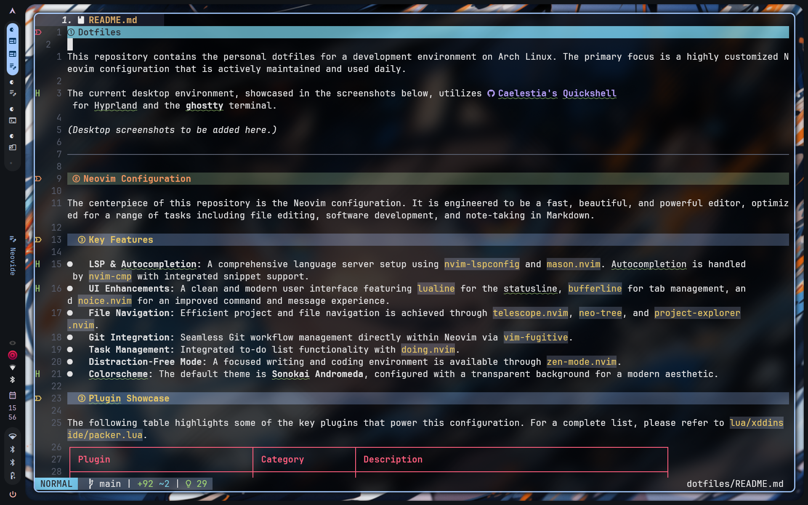
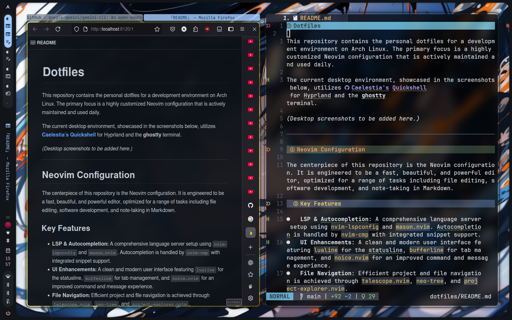
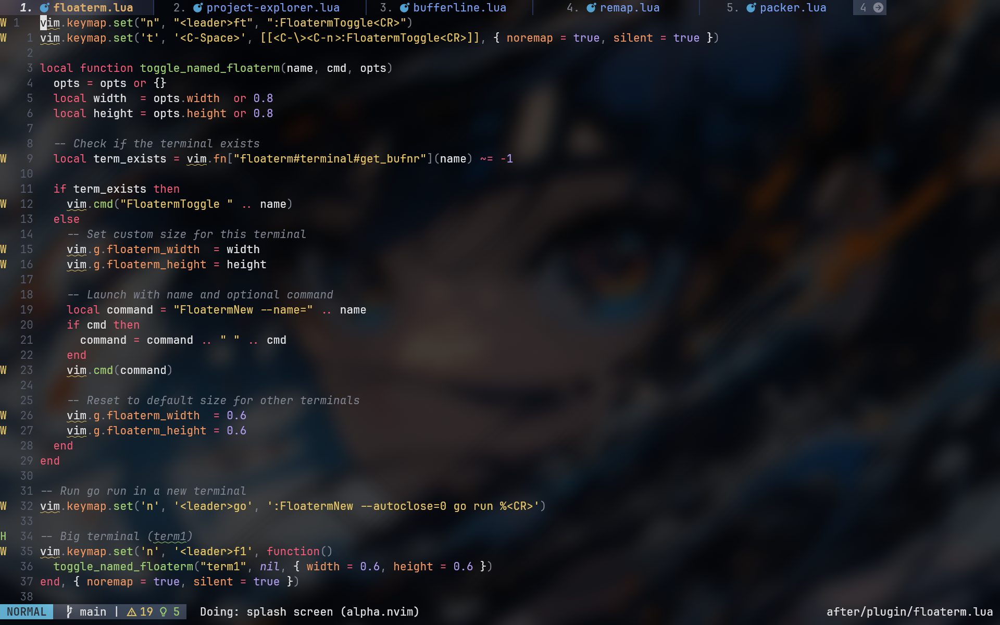
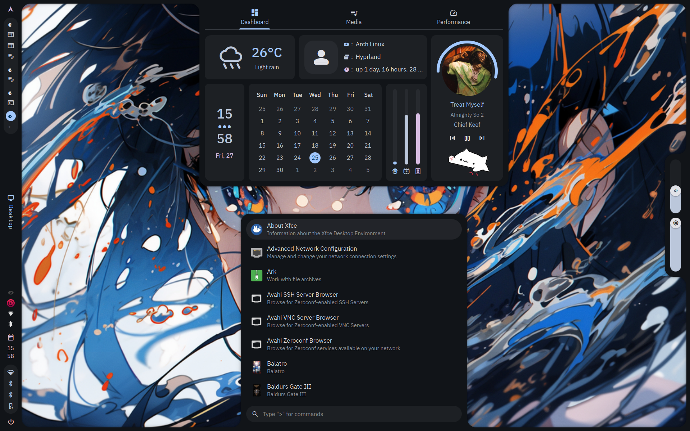
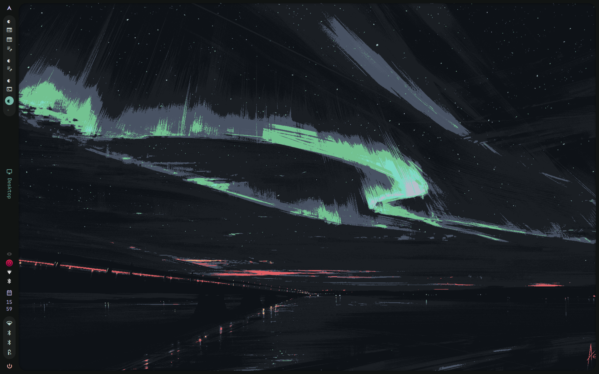
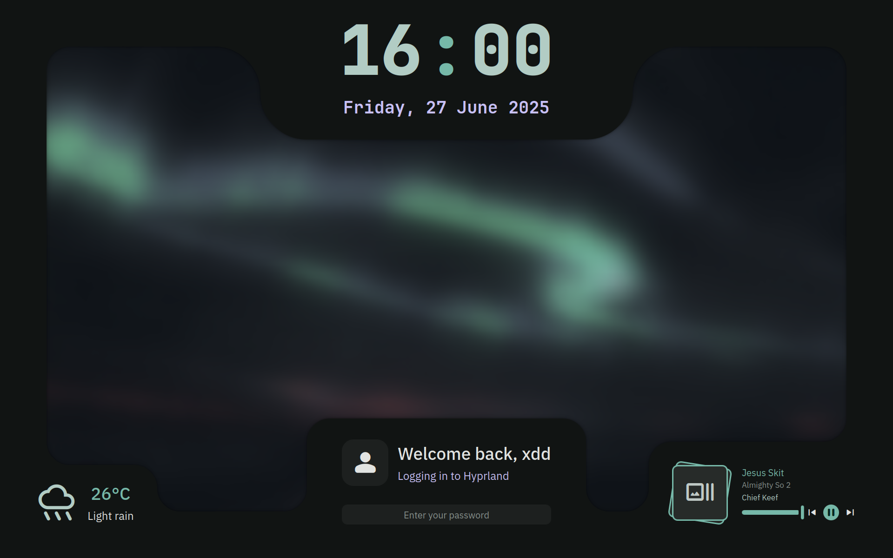

# Dotfiles

This repository contains the personal dotfiles for a development environment on Arch Linux. The primary focus is a highly customized Neovim configuration that is actively maintained and used daily.

The current desktop environment, showcased in the screenshots below, utilizes [**Caelestia's Quickshell**](https://github.com/caelestia-dots/shell) for Hyprland, the [**ghostty**](https://ghostty.org/) terminal and [**Neovide**](https://neovide.dev/) for Neovim.

<table align="center">
  <tr>
    <td align="center"></td>
    <td align="center"></td>
    <td align="center"></td>
  </tr>
  <tr>
    <td align="center"></td>
    <td align="center"></td>
    <td align="center"></td>
  </tr>
</table>

---

## Neovim Configuration

The centerpiece of this repository is the Neovim configuration. It is engineered to be a fast, beautiful, and powerful editor, optimized for a range of tasks including file editing, software development, and note-taking in Markdown.

### Key Features

-   **LSP & Autocompletion:** A comprehensive language server setup using `nvim-lspconfig` and `mason.nvim`. Autocompletion is handled by `nvim-cmp` with integrated snippet support.
-   **UI Enhancements:** A clean and modern user interface featuring `lualine` for the statusline, `bufferline` for tab management, and `noice.nvim` for an improved command and message experience.
-   **File Navigation:** Efficient project and file navigation is achieved through `telescope.nvim`, `neo-tree`, and `project-explorer.nvim`.
-   **Git Integration:** Seamless Git workflow management directly within Neovim via `vim-fugitive`.
-   **Task Management:** Integrated to-do list functionality with `doing.nvim`.
-   **Distraction-Free Mode:** A focused writing and coding environment is available through `zen-mode.nvim`.
-   **Colorscheme:** The default theme is **Sonokai Andromeda**, configured with a transparent background for a modern aesthetic.

### Plugin Showcase

The following table highlights some of the key plugins that power this configuration. For a complete list, please refer to `lua/xddinside/packer.lua`.

| Plugin                          | Category         | Description                                            |
| ------------------------------- | ---------------- | ------------------------------------------------------ |
| `wbthomason/packer.nvim`        | Plugin Manager   | Manages all other plugins.                             |
| `nvim-telescope/telescope.nvim` | Fuzzy Finder     | Find, filter, preview, and pick files, buffers, & more. |
| `sainnhe/sonokai`               | Colorscheme      | The primary, beautiful color palette.                  |
| `nvim-lualine/lualine.nvim`     | UI               | A blazing fast and easy to configure statusline.       |
| `neovim/nvim-lspconfig`         | LSP              | Configurations for the Neovim LSP client.              |
| `hrsh7th/nvim-cmp`              | Completion       | A completion engine plugin for Neovim.                 |
| `nvim-treesitter/nvim-treesitter`| Syntax           | Provides advanced syntax highlighting and more.        |
| `ThePrimeagen/harpoon`          | Navigation       | Quickly mark and jump to important files.              |
| `folke/zen-mode.nvim`           | UI               | Provides a distraction-free coding environment.        |
| `Hashino/doing.nvim`            | Utility          | A simple to-do list manager integrated into the editor.|

### Core Keybindings

Keybindings are mapped for ergonomic and intuitive access. The leader key is set to `<Space>`.

<strong>View Core Keybindings</strong>

| Keybinding        | Mode   | Description                                    |
| ----------------- | ------ | ---------------------------------------------- |
| `<leader>pv`      | Normal | Open file explorer (Netrw)                     |
| `<leader>n`       | Normal | Toggle NeoTree file explorer                   |
| `<leader>fp`      | Normal | Open Project Explorer                          |
| `<leader>pf`      | Normal | Find files with Telescope                      |
| `<C-p>`           | Normal | Find git files with Telescope                  |
| `<leader>w`       | Normal | Write (save) current buffer                    |
| `<leader>q`       | Normal | Quit current buffer                            |
| `<Tab>` / `<S-Tab>` | Normal | Cycle through buffers                          |
| `<leader>gs`      | Normal | Open Git status (Fugitive)                     |
| `<leader>zz`      | Normal | Toggle Zen Mode                                |
| `<leader>da`      | Normal | Doing.nvim: Add a new task                     |
| `<leader>de`      | Normal | Doing.nvim: Edit tasks                         |
| `K`               | Normal | Show LSP hover documentation                   |
| `gd`              | Normal | Go to definition                               |
| `<leader>f`       | Normal | Format buffer with LSP                         |

*For a complete list, please refer to the `keymaps.md` file.*

---

## Window Manager & Terminal

### Hyprland Setup

The Hyprland dotfiles included in this repository are archived from a previous setup based on [**HyDE's dotfiles**](https://github.com/HyDE-Project/HyDE). The current, active configuration uses [Caelestia dots](https://github.com/caelestia-dots/shell), which are based on [**Quickshell**](https://quickshell.outfoxxed.me/), and is not maintained in this repository. The old files are retained for archival purposes.

### Terminal

The primary terminal emulator is **ghostty**, chosen for its speed and simplicity. I use it barebones with very  minimal configuration, hence the absence of extensive dotfiles for it here.

### Shell (Zsh)

The shell environment is powered by **Zsh** and **Oh My Zsh**, with the **Powerlevel10k** theme for a fast and feature-rich prompt. The `.zshrc` file contains numerous custom aliases and functions to streamline common tasks.

---

## Acknowledgements

This configuration has been inspired by the work of many in the open-source community.
- The previous Hyprland setup was based on [**HyDE's dotfiles**](https://github.com/HyDE-Project/HyDE).
- The current setup is [**Caelestia's dotfiles**](https://github.com/caelestia-dots/shell) with [**Quickshell**](https://quickshell.outfoxxed.me/).
- Various other inspirations are credited within the configuration files themselves.
